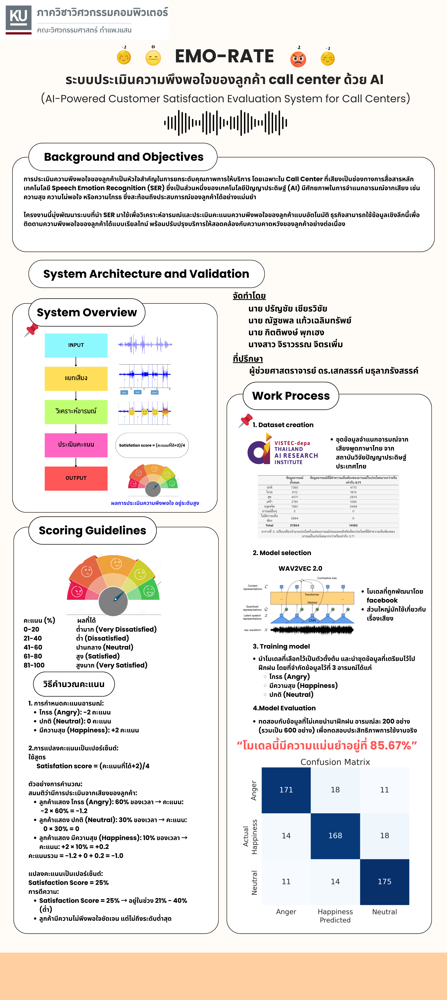

# Thai-Emotion-and-Satisfaction-Assessment-AI
Using fine-turned wav2vec2-large-xlsr-53-th model to analyze Thai people's emotions and derive a satisfaction score.  
  

===========================  
 How to start this project  
===========================  
1.clone this repository  
2.install requirements.txt **(i use python version 3.11.10)  
3.install ffmpeg  
4.restart your device after install ffmpeg  
4.use this command "python -m flask --app app run --host=0.0.0.0 --port=8080 --debug" to run project  
